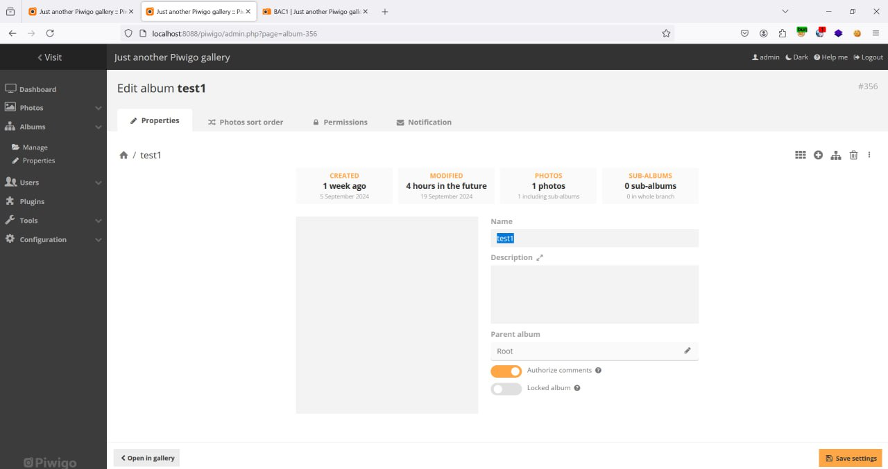
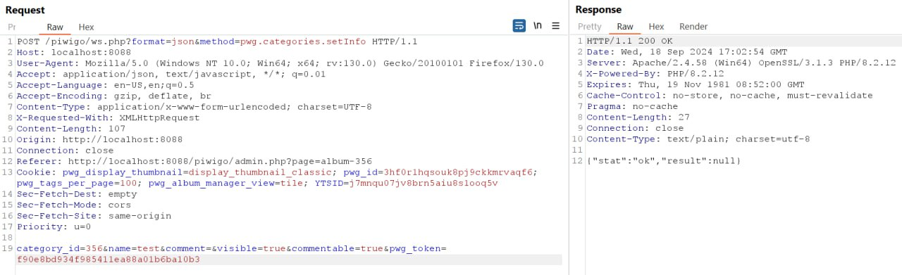
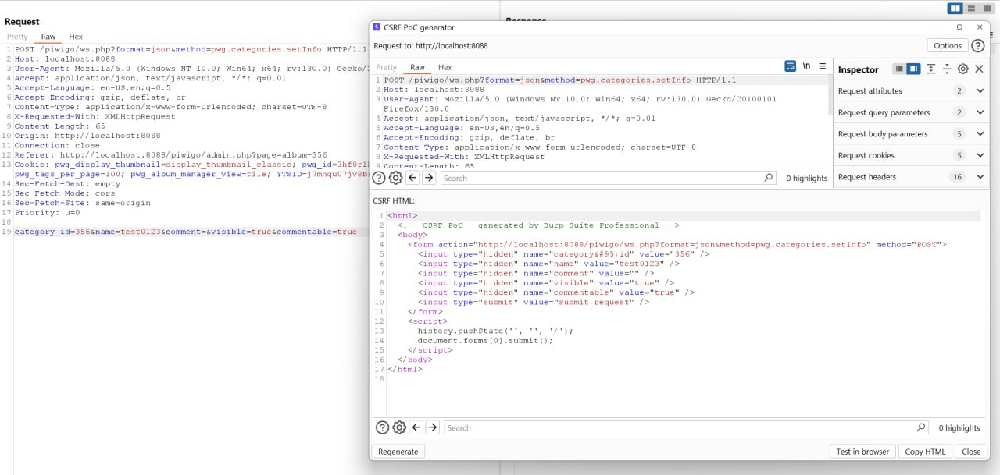
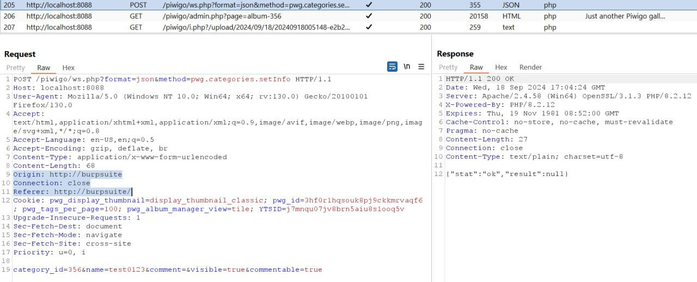
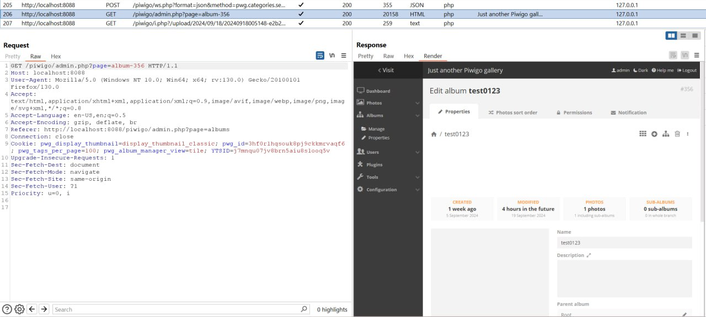
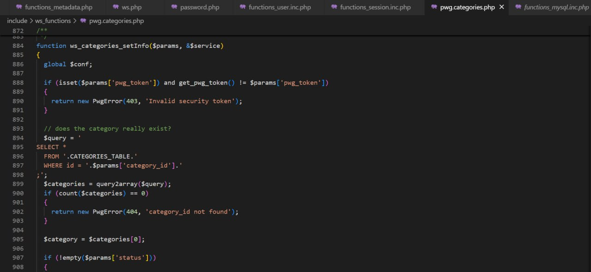

## In Piwigo v14.5.0, I found CSRF Vulnerability in function Change Name Album  
Piwigo v14.5.0: [https://github.com/Piwigo/Piwigo]  

In the Edit album function, the application uses Anti-CSRF token but does not handle it correctly, resulting in the fact that when deleting this field, the request to change information can still be made. 

## Reproduce bug: 
Step 1: Login with admin account and go to Edit album Screen. 

We can see Album name is test1  

Step 2: Request Edit Album Original

Step 3: Payload attack CSRF change Album name to test0123 (pwd_token field removed, pwd_token is the anti-csrf field deployed by the application)

Step 4: Request Edit Album CSRF to test0123 after victim clicks on trap page

Step 5: Album name changed to test0123 successfully

We can go into the processing code in the pwg.categories.php file  

It can be seen that in this function, from line 888->891, the application only checks the pwg_token if it exists, in case the pwg_token does not exist, it will be completely ignored.
